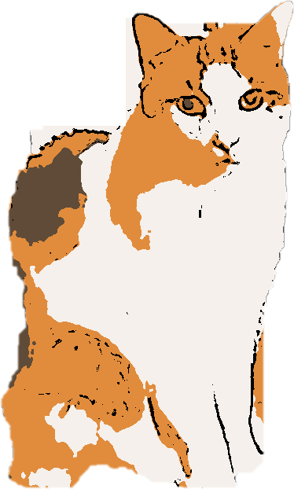

# Buddy Desktop Pet

*In memory of Buddy — a good cat, gone too soon. June 18, 2026.*

---

A Windows-95-Neko-style desktop pet for Ubuntu/GNOME — built to keep Buddy's memory alive.

Buddy was a real cat, one of four: Rambo, Buddy, Teddy, and Minnie. This project is a way
to keep him around — sitting in the corner of the screen, stretching, napping in his bed,
just like he always did.

Buddy lives in the bottom-right corner of your screen. He sits, stretches, meows, plays,
takes little strolls, and puts himself to bed. Fully transparent, always on top.



## Features

- Transparent always-on-top window (no background, no border)
- Autonomous behavior — no mouse chasing, Buddy does his own thing
- Animations: idle, sit, stretch, meow, jump, play, wander, sleep
- Walks to his bed and sleeps for a while, then wakes up on his own
- Purrs when content, meows when you click him
- Left-click to meow (or wake him up) | Right-click to quit
- Stays on your primary monitor on dual-screen setups
- Auto-starts on login (via GNOME autostart)

## Requirements

- Ubuntu 24.04 / GNOME (X11)
- Python 3
- GTK3 with RGBA visual support
- Dependencies:

```bash
pip install pillow pygame numpy
sudo apt install python3-gi python3-gi-cairo gir1.2-gtk-3.0
```

## Running

```bash
python3 src/buddy_pet.py &
```

## Auto-start on login

```bash
cp autostart/buddy-pet.desktop ~/.config/autostart/
```

Or create `~/.config/autostart/buddy-pet.desktop`:

```ini
[Desktop Entry]
Type=Application
Name=Buddy Desktop Pet
Exec=python3 /path/to/buddy_pet/src/buddy_pet.py
X-GNOME-Autostart-enabled=true
```

## Project structure

```
assets/
  frames/          # Individual animation frames (PNG, RGBA)
  cat_sheet_raw.png  # Source sprite sheet
  bed.png          # Cat bed prop
  meow.mp3         # Meow sound
  purr.mp3         # Purr sound
src/
  buddy_pet.py     # Main app — run this
  slice_sprites.py # Re-slices frames from the raw sprite sheet
  make_bed.py      # Regenerates the bed asset
  anim_inspector.py  # Preview animations in pygame
```

## Credits

- Buddy was a real cat, loved and missed
- Sprite sheet generated with Gemini
- Built with Python, GTK3, Cairo, Pillow, pygame
